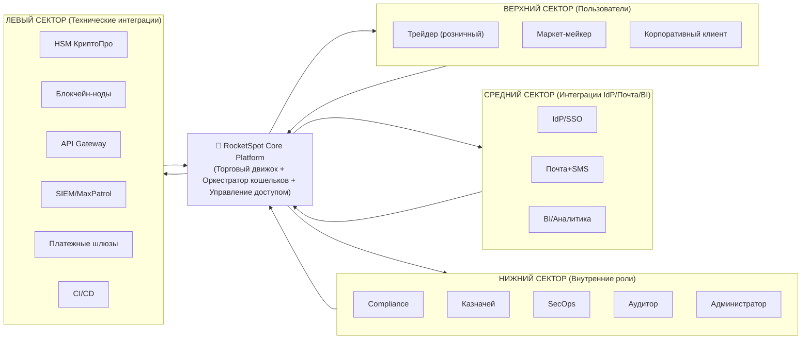

---

# Cистемная инженерия.  Проектирование криптобиржи **RocketSpot**.

---

## 1. Контекст и границы системы (System of Interest - SoI)

### 1.1 Цель системы (Миссия)
Спроектировать, реализовать и эксплуатировать **высоконадежную, безопасную и соответствующую нормативным требованиям платформу для криптовалютной биржи RocketSpot**, которая обеспечивает:
*   **Self-service управление ключами и доступом** к API для торговли, вывода средств и управления счетами.
*   **Оркестрацию "холодных" и "горячих" кошельков** с гарантированной безопасностью и соблюдением SLA на вывод средств.
*   **Централизованный аудит и контроль** всех операций с активами, соответствующий требованиям ЦБ РФ (по аналогии с НФО), ПОД/ФТ и внутренним политикам ИБ.
*   **Изоляцию** между различными типами клиентов (розничные, корпоративные, маркет-мейкеры) и внутренними сервисами биржи.

### 1.2 Контекст (Среда и внешние системы)
*   **Эксплуатационная среда:** Гибридное облако (Yandex Cloud / собственный ЦОД), изолированные сегменты сети (DMZ, сеть обработки платежей, HSM-сегмент).
*   **Операционный контур:** Platform Engineering, SecOps, Treasury (казначейство), Compliance, Legal.
*   **Каналы взаимодействия:**
    *   **Web UI/Мобильное приложение:** для трейдеров и корпоративных клиентов.
    *   **REST/WebSocket API:** для алгоритмической торговли и партнерских интеграций.
    *   **Административная консоль:** для операторов биржи и ИБ-аналитиков.
*   **Ключевые ограничения:**
    *   **Регуляторные:** 115-ФЗ, 259-ФЗ (О внесении изменений в отдельные законодательные акты РФ), требования к хранению данных (ФЗ-152), локализации персональных данных на территории РФ.
    *   **Технические:** Криптографическая стойкость (ГОСТ Р 34.10-2012/2021, использование НСДКИ), разделение "горячих" и "холодных" хранилищ, использование HSM (Hardware Security Module).

### 1.3 Контекстная диаграмма RocketSpot (Сервис управления доступом и оркестрации криптоактивов)



### 1.4 Код диаграммы

<details>
<summary>📁 Показать код диаграмм (кликните для раскрытия)</summary>

```dot
graph LR
    subgraph LEFT["ВЕРХНИЙ СЕКТОР (Пользователи)"]
        direction TB
        Trader["Трейдер (розничный)"]
        MM["Маркет-мейкер"]
        Corporate["Корпоративный клиент"]
    end

    subgraph TOP["СРЕДНИЙ СЕКТОР (Интеграции IdP/Почта/BI)"]
        direction LR
        SSO["IdP/SSO"]
        Mail["Почта+SMS"]
        BI["BI/Аналитика"]
    end

    subgraph RIGHT["НИЖНИЙ СЕКТОР (Внутренние роли)"]
        direction TB
        Compliance["Compliance"]
        Treasury["Казначей"]
        SecOps["SecOps"]
        Auditor["Аудитор"]
        Admin["Администратор"]
    end

    subgraph BOTTOM["ЛЕВЫЙ СЕКТОР (Технические интеграции)"]
        direction LR
        HSM["HSM КриптоПро"]
        Blockchain["Блокчейн-ноды"]
        Gateway["API Gateway"]
        SIEM["SIEM/MaxPatrol"]
        Payment["Платежные шлюзы"]
        CICD["CI/CD"]
    end

    Central["🎯 RocketSpot Core Platform<br/>(Торговый движок + Оркестратор кошельков + Управление доступом)"]

    LEFT --> Central
    TOP --> Central
    RIGHT --> Central
    BOTTOM --> Central

    Central --> LEFT
    Central --> TOP
    Central --> RIGHT
    Central --> BOTTOM
```

</details>

## 1.5 Текстовая декомпозиция (External Entity ↔ Flow)

<details>
<summary> 📁 Показать текстовую декомпозицию (кликните для раскрытия) </summary>

| Внешняя сущность | Поток в систему (Input) | Поток из системы (Output) |
|------------------|------------------------|-------------------------|
| **Трейдер (розничный)** | Торговые ордера, заявки на вывод, API-ключи, 2FA-коды | Исполнение ордеров, статус вывода, балансы, история транзакций |
| **Маркет-мейкер** | Высокочастотные ордера, индивидуальные rate limit запросы | Рыночные данные, статусы лимитов, алерты по рискам |
| **Корпоративный клиент** | Корпоративные выводы, запросы на мультиподпись, API для казначейства | Выписки по счетам, статусы одобрения, экспортные отчеты |
| **IdP / SSO (Keycloak/AD)** | Утверждения доступа, MFA challenge, group claims, session state | Проверка сессии, user info, logout events |
| **Почтовый сервис + SMS** | Статус доставки, bounce events, delivery confirmations | Уведомления о выводах, 2FA коды, подтверждения операций, алерты |
| **BI / Аналитика (Tableau)** | KPI-запросы, AML-отчетность, дашборд-запросы | Агрегированные отчеты, транзакционные данные, метрики SLA |
| **Compliance-офицер** | Установка лимитов, заморозка/разморозка счетов, AML-правила, ручное одобрение | Алерты по подозрительным транзакциям, отчеты по 115-ФЗ, очереди на проверку |
| **Казначей (Treasury)** | Пополнение hot wallet, инициация cold storage вывода, мультиподпись | Статусы резервов, транзакции на подпись, уведомления о движении средств |
| **SecOps / ИБ-аналитик** | Ротация мастер-ключей, emergency revoke, настройки политик безопасности | Алерты безопасности, журнал инцидентов, статусы HSM |
| **Аудитор / Регулятор** | Запрос аудита, compliance check, запрос детализации | Evidence-отчеты, неизменяемый журнал, выгрузки по транзакциям |
| **Администратор платформы** | Настройки системы, override-правила, шаблоны политик, управление инстансами | Ошибки и конфликты, метрики системы, статусы компонентов |
| **HSM Cluster (КриптоПро)** | Криптографические операции, подписанные хэши, статусы ключей | Запрос на подпись транзакции, генерация ключей, ротация |
| **Блокчейн-ноды (BTC/ETH/TRON)** | Подтверждения транзакций, балансы адресов, nonce, fee estimates | Подписанные транзакции, broadcast запросы, getBalance |
| **API Gateway (Kong)** | Проверка токена, rate limit violations, policy check запросы | Политики доступа, revocation updates, allow/deny metadata |
| **SIEM / Логирование (MaxPatrol)** | Теги инцидентов, correlation lookup, enrichment data | События безопасности, audit events, алерты по аномалиям |
| **Платежные шлюзы (Фиат)** | Фиатные депозиты, статусы выплат, чарджбеки | Запросы на выплату, статусы транзакций, верификации |
| **CI/CD (GitLab)** | M2M-запросы, деплой конфигураций, миграции БД | Сервисные учетные данные, статусы операций, health checks |

</details>

## 1.6 Стейкхолдеры (Stakeholders) RocketSpot

| Стейкхолдер | Роль | Интересы / Ожидания | Ключевые требования |
|-------------|------|---------------------|-------------------|
| **Трейдер (розничный)** | Конечный пользователь | Быстрое исполнение ордеров, прозрачность комиссий, безопасность средств, простой вывод | SR-SH-1: Скорость вывода до 30 мин, интуитивный UI |
| **Маркет-мейкер** | Профессиональный трейдер | Низкая задержка (low latency), индивидуальные лимиты API, стабильность WebSocket | SR-SH-2: Rate limit 1000+ RPS, SLA 99.99% |
| **Корпоративный клиент** | Юридическое лицо | Мультиподпись для вывода, интеграция с казначейскими системами, отчетность | SR-SH-6: API для автоматизации, выписки для налоговой |
| **Compliance-офицер** | Сотрудник отдела комплаенс | Инструменты для AML/CFT, блокировка подозрительных счетов, отчетность для 115-ФЗ | SR-SH-3: freeze в real-time, черные списки адресов |
| **Казначей (Treasury)** | Финансовый сотрудник | Управление горячими/холодными кошельками, мультиподпись, контроль ликвидности | SR-SH-4: M of N policy, автоматическая sweep-функция |
| **SecOps / ИБ-аналитик** | Специалист по безопасности | Мониторинг инцидентов, управление ключами HSM, ротация секретов, аудит доступа | SR-SH-5: Все ключи в HSM, revoke SLA < 60 сек |
| **Аудитор / Регулятор** | Внешний контролирующий орган | Неизменяемый журнал операций, возможность экспорта данных, соответствие 115-ФЗ | SR-SH-6: WORM-хранилище, отчет за 1 час по запросу |
| **Администратор платформы** | SRE / Platform Engineer | Наблюдаемость, автоматическое масштабирование, управление конфигурациями | SR-SH-7: HA архитектура, RTO < 15 мин |
| **Бизнес-владелец** | CEO / Product Owner | Рентабельность, удержание клиентов, соответствие регуляторным требованиям | SR-SH-7: Доступность 99.95%, MTTR < 30 мин |
| **Разработчик (Dev)** | Инженер | Понятные API, CI/CD, тестовая среда, документация | SR-SH-8: Swagger/OpenAPI, локальный запуск, тестовые сети |

### 1.7 Контекстная диаграмма (L0: SoI ↔ внешние сущности)

```mermaid

graph TB
    subgraph Users["👥 ПОЛЬЗОВАТЕЛИ И ПАРТНЕРЫ"]
        Trader["Трейдер<br/>(розничный/корпоративный)"]
        MM["Маркет-мейкер"]
    end

    subgraph InternalRoles["👔 ВНУТРЕННИЕ РОЛИ"]
        Compliance["Compliance-офицер<br/>(AML/CFT)"]
        Treasury["Казначей<br/>(Treasury)"]
        SecOps["SecOps<br/>(Security Operations)"]
    end

    subgraph ExternalSystems["🏛️ ВНЕШНИЕ ОРГАНЫ"]
        Gov["Государственные органы<br/>(ФНС, Росфинмониторинг)"]
    end

    subgraph TechInfra["⚙️ ТЕХНИЧЕСКАЯ ИНФРАСТРУКТУРА"]
        HSM["HSM Cluster<br/>(КриптоПро)"]
        Blockchain["Блокчейн-ноды<br/>(BTC/ETH/TRON)"]
        Banks["Банки-эквайеры<br/>Платежные системы"]
    end

    Central["🎯 TokenSpot Core Platform<br/>──────────────────<br/>Торговый движок | Оркестратор кошельков<br/>API Gateway | AML/CFT Движок<br/>HSM-Адаптер | KMS | Аудиторское хранилище"]

    %% Потоки: Трейдер
    Trader -->|"Заявка на вывод<br/>API-ключи для торговли"| Central
    Central -->|"Статус вывода<br/>API-секреты<br/>История транзакций"| Trader

    %% Потоки: Маркет-мейкер
    MM -->|"Высокочастотные ордера<br/>Алгоритмическая торговля"| Central
    Central -->|"Рыночные данные<br/>Статусы лимитов"| MM

    %% Потоки: Compliance
    Compliance -->|"Установка лимитов<br/>Заморозка средств<br/>Запросы на детализацию"| Central
    Central -->|"Алерты по подозрительным транзакциям<br/>AML-отчеты"| Compliance

    %% Потоки: Treasury
    Treasury -->|"Пополнение hot wallet<br/>Подписание мультисиг транзакций<br/>Управление холодным хранилищем"| Central
    Central -->|"Статусы резервов<br/>Транзакции на подпись"| Treasury

    %% Потоки: SecOps
    SecOps -->|"Ротация ключей<br/>Emergency revoke<br/>Управление политиками безопасности"| Central
    Central -->|"Алерты безопасности<br/>Журнал инцидентов"| SecOps

    %% Потоки: Госорганы
    Gov -->|"Запросы отчетности<br/>Проверки compliance"| Central
    Central -->|"Отчеты по 115-ФЗ<br/>Данные по запросам"| Gov

    %% Потоки: HSM
    Central -->|"Запрос на генерацию ключей<br/>Запрос на подпись транзакции"| HSM
    HSM -->|"Сгенерированные ключи<br/>Подписанные хэши"| Central

    %% Потоки: Блокчейн-ноды
    Central -->|"Подписанные транзакции<br/>Broadcast запросы"| Blockchain
    Blockchain -->|"Подтверждения транзакций<br/>Балансы адресов<br/>Nonce, fee estimates"| Central

    %% Потоки: Банки/Платежные системы
    Banks -->|"Фиатные депозиты<br/>Статусы выплат"| Central
    Central -->|"Запросы на выплату<br/>Чарджбеки"| Banks

    %% Стилизация
    classDef centralStyle fill:#cfe6ff,stroke:#2b4c66,stroke-width:3px,color:#000,font-weight:bold
    classDef userStyle fill:##000000,stroke:#0288d1,stroke-width:2px
    classDef roleStyle fill:##000000,stroke:#7b1fa2,stroke-width:2px
    classDef govStyle fill:##000000,stroke:#c62828,stroke-width:2px
    classDef techStyle fill:##000000,stroke:#2e7d32,stroke-width:2px
    
    class Central centralStyle
    class Trader,MM userStyle
    class Compliance,Treasury,SecOps roleStyle
    class Gov govStyle
    class HSM,Blockchain,Banks techStyle

```

<details>
<summary>📁 Показать контекстную диаграмму (кликните для раскрытия)</summary>



**Внешние сущности:**
1.  **Трейдер (Розничный/Корпоративный):** Человек или алгоритм, взаимодействующий через UI/API.
2.  **Маркет-мейкер:** Внешний партнер с высокорисковыми объемами торгов.
3.  **Инспектор по комплаенсу (Compliance Officer):** Сотрудник, отслеживающий подозрительные транзакции (AML/CFT).
4.  **Казначей (Treasury):** Сотрудник, управляющий резервами биржи и ликвидностью.
5.  **SecOps (Security Operations):** Команда, реагирующая на инциденты и управляющая ключами HSM.
6.  **Государственные органы (ФНС, Росфинмониторинг):** Получатели отчетности и данных в рамках запросов.
7.  **HSM Cluster:** Аппаратный кластер для генерации и хранения мастер-ключей.
8.  **Блокчейн-ноды (Bitcoin, Ethereum и др.):** Внешние сети для проведения транзакций.
9.  **Банки-эквайеры / Платежные системы:** Для фиатных шлюзов (рубли).

**Потоки данных:**
*   **Трейдер → SoI:** Заявка на вывод, API-ключи для торговли.
*   **SoI → Трейдер:** Статус вывода, сгенерированные API-секреты, история транзакций.
*   **Compliance → SoI:** Установка лимитов, заморозка средств, запросы на детализацию.
*   **SoI → Compliance:** Алёрты по подозрительным транзакциям, отчеты.
*   **Treasury → SoI:** Запросы на пополнение "горячего" кошелька, подписание мультисиг транзакций "холодного" хранилища.
*   **SoI → HSM:** Запросы на генерацию ключей, подпись транзакций (аппаратно).
*   **SoI → Блокчейн-ноды:** Публикация подписанных транзакций.

</details>

### 1.8 Границы SoI

<details>
<summary>📁 Показать границы SoI (кликните для раскрытия)</summary>

#### 1.8.1 Внутри SoI (Разрабатываемые компоненты)
1.  **Торговый движок (Matching Engine):** Ядро биржи.
2.  **Клиентский портал / API Gateway:** Шлюз для внешних запросов, управление сессиями и API-ключами.
3.  **Оркестратор Кошельков (Wallet Orchestrator):** Управляет подписью и отправкой транзакций. Сердце системы.
4.  **HSM-Адаптер:** Слой абстракции для работы с российскими НСДКИ (КриптоПро, ViPNet).
5.  **AML/CFT Движок:** Система правил для мониторинга транзакций.
6.  **Система Управления Ключами (KMS):** Жизненный цикл ключей (генерация, ротация, отзыв).
7.  **Аудиторское Хранилище:** Неизменяемый журнал всех критических событий.
8.  **Административная консоль (Admin Back Office):** Управление лимитами, пользователями, системами.

#### 1.8.2 Снаружи SoI (Интегрируемые системы)
*   **HSM Cluster (КриптоПро HSM / другие):** Внешний аппаратный модуль.
*   **Блокчейн-ноды (RPC):** Сеть блокчейна (инфраструктура).
*   **SIEM (например, MaxPatrol, Kaspersky):** Внешняя система сбора и корреляции событий.
*   **Внешние сервисы KYC (например, Sumsub):** Проверка клиентов.
*   **Платежные шлюзы (Фиат):** Сбербанк, Тинькофф и т.д.

</details>

---

## 2. CONOPS (Концепция операций)

### 2.1 Роли и поведение

<details>
<summary>📁 Показать (кликните для раскрытия)</summary>

*   **Трейдер (Клиент)**
    *   **Цель:** Торговать и выводить средства.
    *   **Действия:** Создает API-ключи с ограниченными правами (только торговля, без вывода). Инициирует вывод средств. Подтверждает вывод через Email/2FA.
    *   **Ограничения:** Не может вывести больше суточного/месячного лимита. Не может генерировать ключи для вывода без 2FA.

*   **Compliance-офицер (AML)**
    *   **Цель:** Обеспечить соответствие 115-ФЗ, предотвратить отмывание средств.
    *   **Действия:** Устанавливает риск-профили (LOW/MEDIUM/HIGH). Замораживает счета по подозрению. Формирует отчеты для Росфинмониторинга.
    *   **Критичные ожидания:** Полная история транзакций, возможность блокировки вывода в реальном времени.

*   **Казначей (Treasury)**
    *   **Цель:** Управлять ликвидностью биржи и безопасностью холодного хранилища.
    *   **Действия:** Инициирует перемещение средств из "горячего" кошелька в "холодный" и обратно. Участвует в мультиподписи (M of N) для критических транзакций.
    *   **Критичные ожидания:** Управляемый процесс мультиподписи, защита от внутреннего мошенничества.

*   **Инженер SecOps**
    *   **Цель:** Обеспечить целостность системы управления ключами.
    *   **Действия:** Производит ротацию мастер-ключей в HSM. Расследует инциденты безопасности.
    *   **Ограничения:** Не может один подписать транзакцию на вывод из холодного хранилища (требует кворума).

</details>

### 2.2 Ключевой сценарий: Вывод криптовалюты (BTC, ETH)

<details>
<summary>📁 Показать  (кликните для раскрытия)</summary>

**Цель:** Обеспечить безопасный и предсказуемый вывод средств клиента, с балансом между автоматизацией (скорость) и безопасностью (сумма).

1.  **Инициирование:** Трейдер на UI запрашивает вывод 0.5 BTC.
2.  **Предварительная проверка (Pre-flight):**
    *   **Аутентификация:** Проверка 2FA, сессии.
    *   **AML Check:** Движок AML проверяет адрес получателя по черным спискам и оценивает риск транзакции. Если риск > порога -> автоматический холд.
    *   **Лимиты:** Проверка суточного лимита вывода.
3.  **Блокировка средств:** Система резервирует 0.5 BTC на "горячем" кошельке клиента.
4.  **Сборка транзакции:** Оркестратор кошельков формирует сырую транзакцию (UTXO для BTC, raw tx для ETH).
5.  **Согласование (Workflow):**
    *   Если сумма < 10,000 USD -> **Автоматическая подпись** (через HSM).
    *   Если сумма >= 10,000 USD -> **Step-up Approval**: Заявка уходит в очередь Compliance-офицера на быстрый просмотр (автоматизация через правила).
6.  **Подпись:** Адаптер HSM отправляет хэш транзакции в HSM. HSM (работающий по ГОСТ) возвращает подпись. Для сумм выше 100,000 USD может требоваться мультиподпись (2 из 3 операторов казначейства подтверждают в админке).
7.  **Публикация:** Оркестратор отправляет подписанную транзакцию в блокчейн-ноду.
8.  **Финализация:** Система отслеживает количество подтверждений сети (confirmations). После достижения порога списывает средства со счета клиента и закрывает заявку.

</details>

---

## 3. Требования

### 3.1 Stakeholder requirements (SR-SH)

*   **SR-SH-1 (Трейдер):** Высокая скорость исполнения вывода (до 30 мин для low-risk транзакций) с прозрачным статусом.
*   **SR-SH-2 (Маркет-мейкер):** Возможность создания API-ключей с индивидуальными лимитами на количество запросов в секунду (Rate Limit) без необходимости проходить KYC повторно.
*   **SR-SH-3 (Compliance):** Возможность в реальном времени приостановить (freeze) любой вывод средств или заблокировать учетную запись на основании внутреннего риск-скоринга.
*   **SR-SH-4 (Treasury):** Должна быть реализована политика "M of N" (мультиподпись) для всех транзакций из "холодного" хранилища, где ни один сотрудник не имеет полного контроля.
*   **SR-SH-5 (SecOps):** Все мастер-ключи должны генерироваться и храниться исключительно в сертифицированных ФСБ России HSM.
*   **SR-SH-6 (Аудитор/Регулятор):** Система должна предоставлять детальный отчет по любой транзакции (включая IP-адрес, user-agent, время утверждения) в течение 1 часа по официальному запросу.
*   **SR-SH-7 (Бизнес):** Система должна быть отказоустойчивой: отсутствие единой точки отказа (HA) в компонентах оркестрации кошельков и торгового движка.

### 3.2 Системные требования (SR-SYS) - Выдержки

*   **SR-SYS-1 (Криптография):** Все взаимодействия с блокчейном и хранение мнемонических фраз должны осуществляться через HSM (КриптоПро). Запрещено хранение приватных ключей в программном виде.
*   **SR-SYS-2 (Жизненный цикл ключей):** Период ротации мастер-ключей HSM не должен превышать 1 год. Процесс ротации требует физического присутствия 2 сотрудников SecOps.
*   **SR-SYS-3 (AML):** Система должна проверять все исходящие адреса по списку "Санкционных адресов" (OFAC, SDN и российские аналоги) перед подписью.
*   **SR-SYS-4 (API Gateway):** API-ключи клиента должны поддерживать scopes: `trade` (торговля), `withdraw` (вывод), `info` (только чтение). Ключ с scope `withdraw` требует обязательной привязки к IP-адресу.
*   **SR-SYS-5 (Аудит):** Все административные действия (изменение лимитов, разморозка) должны логироваться в WORM-хранилище (Write Once Read Many) с гарантией неизменности в течение 5 лет.

### 3.3 NFR (Нефункциональные требования) с метриками

*   **NFR-1 (Доступность):** Доступность торгового API (матчинг) — **99.99%** в месяц. Доступность интерфейса вывода — **99.95%**.
*   **NFR-2 (Задержки):** Время подписи транзакции через HSM (аппаратно) — **p99 < 1 секунда**.
*   **NFR-3 (Безопасность):** Время отклика системы на экстренную блокировку (kill-switch) — **не более 5 секунд** после нажатия администратором.
*   **NFR-4 (Управление рисками):** Процент ложных срабатываний AML-движка (false positives) — **менее 0.5%** от общего числа транзакций.
*   **NFR-5 (Масштабируемость):** Система оркестрации кошельков должна выдерживать нагрузку **1000 исходящих транзакций в минуту** (при использовании L2-решений типа Lightning Network или оптимизации batch-транзакций).

---

## 4. Архитектура

### 4.1 Декомпозиция компонентов

1.  **Web UI / Mobile Backend:** Общение с клиентом.
2.  **API Gateway (Kong / Traefik):** Маршрутизация, rate limiting, проверка JWT/API-ключей.
3.  **Matching Engine (Core):** Высокопроизводительный движок ордеров (C++/Rust).
4.  **Account & Ledger Service:** Управление балансами, горячее/холодное хранение.
5.  **Orchestrator (Workflow Engine):** Управляет состоянием заявок на вывод (Temporal / Camunda).
6.  **HSM Adapter (ГОСТ):** Прослойка для связи с КриптоПро HSM или аналогичными решениями.
7.  **AML Risk Engine:** Сервис оценки рисков транзакций.
8.  **KMS (Key Management Service):** Внутренний сервис для управления метаданными ключей (не самими ключами).
9.  **Audit & Forensics:** Elasticsearch с WORM-бакетом для долгого хранения.

### 4.2 Ключевые архитектурные решения (ADR)

#### ADR-1: Использование HSM для хранения корневых ключей
*   **Контекст:** Необходимость соответствия законодательству РФ и защита от взлома серверов.
*   **Решение:** Все приватные ключи (горячих и холодных кошельков) генерируются и хранятся внутри сертифицированного HSM (КриптоПро). Сервис подписи обращается к HSM через API.
*   **Trade-off:** Усложнение архитектуры и повышение стоимости инфраструктуры против максимальной защищенности от утечек.

#### ADR-2: Асинхронная оркестрация вывода (Saga Pattern)
*   **Контекст:** Вывод средств включает множество шагов (блокировка -> проверка -> подпись -> отправка -> подтверждение), которые могут длиться часы.
*   **Решение:** Использование распределенного оркестратора саг (например, Temporal). Это позволяет переживать перезагрузки сервисов и обеспечивает консистентность данных при сбоях на шаге подписи.
*   **Trade-off:** Сложность отладки и поддержки стейт-машины против гарантий финишности (completion guarantee) для каждой заявки.

#### ADR-3: Изоляция торгового движка и кошельков
*   **Контекст:** Торговый движок требует максимальной производительности, а сервис кошельков — максимальной безопасности.
*   **Решение:** Физическое разделение: торговый движок работает в "сети обработки данных", а HSM и оркестратор кошельков — в "сети активов". Общение происходит через строго контролируемые очереди сообщений (Kafka/RabbitMQ) с использованием шифрования на уровне приложения.

### 4.3 Технологический стек (Языки программирования и фреймворки)

#### Backend (Высоконагруженные сервисы)

| Компонент | Язык / Фреймворк | Обоснование |
|-----------|-----------------|-------------|
| **Торговый движок (Matching Engine)** | **Rust** (или C++ для legacy) | Максимальная производительность, предсказуемая задержка (low latency), memory safety. Использование `tokio` для асинхронности. |
| **Оркестратор кошельков (Wallet Orchestrator)** | **Go** | Баланс производительности и скорости разработки. `Temporal.io` для saga-оркестрации. |
| **API Gateway** | **Kong** (Lua) / **Traefik** (Go) | Готовые плагины для rate limiting, JWT, интеграция с Keycloak. |
| **Account & Ledger Service** | **Java 17+ / Spring Boot** | Стабильность, транзакционность, поддержка ACID, Spring Data JPA + PostgreSQL. |
| **AML Risk Engine** | **Python 3.11+** | Богатая экосистема ML/AI (scikit-learn, pandas), гибкость для правил. `FastAPI` для REST. |
| **HSM Adapter (ГОСТ)** | **C++ / C#** | Работа с нативными библиотеками КриптоПро, низкоуровневый доступ к HSM. |
| **KMS / Policy Engine** | **Go** | Легковесные микросервисы, высокая конкурентность. |

#### Frontend

| Компонент | Фреймворк | Обоснование |
|-----------|----------|-------------|
| **Клиентский портал (Web)** | **React 18 + TypeScript** | Компонентный подход, типобезопасность, экосистема (MUI, Redux Toolkit). |
| **Административная консоль (Admin)** | **React + Ant Design** | Быстрая разработка сложных таблиц, дашбордов. |
| **Мобильное приложение** | **React Native** | Единая codebase для iOS/Android, быстрый вывод на рынок. |

#### Data & Infrastructure

| Компонент | Технология | Обоснование |
|-----------|-----------|-------------|
| **База данных (OLTP)** | **PostgreSQL 15+** | ACID, надежность, поддержка JSONB, паттерн "CQRS" с read replicas. |
| **Кэш / Сессии** | **Redis Cluster** | Высокая производительность, поддержка pub/sub для инвалидации. |
| **Очереди сообщений** | **Apache Kafka** | At-least-once delivery, replayability, горизонтальное масштабирование. |
| **Оркестрация саг** | **Temporal.io** | Долгоживущие workflows, автоматические retry, visibility. |
| **Мониторинг** | **Prometheus + Grafana** | Индустриальный стандарт, метрики в формате OpenMetrics. |
| **Логи** | **ELK Stack (Elasticsearch, Logstash, Kibana)** + **WORM storage** | Поиск и долгосрочное хранение аудита. |
| **Контейнеризация** | **Docker + Kubernetes (Yandex Cloud / Managed K8s)** | Оркестрация, автоматическое масштабирование, изоляция tenant-ов. |
| **CI/CD** | **GitLab CI** | Единый пайплайн, интеграция с Kubernetes, security scanning (SAST/DAST). |
| **HSM (ГОСТ)** | **КриптоПро HSM / ViPNet HSM** | Сертификация ФСБ, аппаратная защита ключей, поддержка ГОСТ Р 34.10-2021. |

---

## 5. Интерфейсы (API)

### 5.1 Контракт: POST /api/v2/withdraw (для трейдера)

**Заголовки:**
*   `Authorization: Api-Key <key>`
*   `X-Signature: <HMAC-SHA512(body + timestamp)>`
*   `X-Timestamp: <unix_time>`

**Запрос:**
```json
{
  "currency": "BTC",
  "address": "1A1zP1eP5QGefi2DMPTfTL5SLmv7DivfNa",
  "amount": "0.5",
  "network": "BTC",
  "twofa_code": "123456"
}
```

**Ответ (202 Accepted):**
```json
{
  "withdrawal_id": "wd-123e4567-e89b-12d3-a456-426614174000",
  "status": "pending_aml_check",
  "estimated_finish_time": "2023-10-27T10:30:00Z"
}
```

### 5.2 Внутреннее событие: `TransactionSignedEvent`

**Назначение:** Оповещение Ledger-сервиса о списании средств после успешной отправки в сеть.
**Схема:**
```json
{
  "event_id": "evt-123",
  "withdrawal_id": "wd-...",
  "tx_hash": "0x123...abc",
  "signed_at": "2023-10-27T10:25:00Z",
  "signer": "hsm-cluster-01",
  "signature_type": "ГОСТ Р 34.10-2021"
}
```

---

## 6. Реестр рисков (Криптобиржа)

| ID | Риск | Вероятность | Влияние | Меры предотвращения |
| :--- | :--- | :--- | :--- | :--- |
| **R-01** | **Утечка ключей горячего кошелька** | Низкая | Критическое | Использование HSM, ротация ключей каждые 24 часа, автоматическая отправка излишков в холодное хранилище. |
| **R-02** | **51% атака на сеть блокчейна (для PoW)** | Средняя | Высокое | Ожидание увеличенного количества подтверждений (confirmations) для крупных депозитов. Использование нескольких надежных нод. |
| **R-03** | **Ошибка оркестратора (дублирование отправки)** | Низкая | Высокое | Идемпотентность операций (проверка `tx_hash` в блокчейне перед отправкой), строгий стейт-менеджмент. |
| **R-04** | **Заморозка средств регулятором** | Средняя | Среднее | Наличие юридической структуры, позволяющей взаимодействовать с запросами, автоматизация формирования отчетности (115-ФЗ). |
| **R-05** | **Атака на API-ключи трейдера** | Средняя | Среднее | Обязательная привязка IP для ключей с правами на вывод, обязательное использование 2FA для создания ключей. |

---

## 7. Validation & Verification (V&V) / Тестовые сценарии

### TC-01: Вывод криптовалюты low-risk (автоматический)
| Атрибут | Значение |
|---------|---------|
| **ID** | TC-WD-001 |
| **Название** | Автоматический вывод low-risk суммы |
| **Предусловия** | Клиент с KYC `VERIFIED`, risk score `LOW`, баланс > 0.01 BTC, 2FA включена |
| **Шаги** | 1. Клиент инициирует вывод 0.01 BTC на валидный адрес<br>2. Система выполняет AML-скоринг (адрес не в черном списке)<br>3. Подпись транзакции через HSM (КриптоПро)<br>4. Отправка в сеть Bitcoin<br>5. Мониторинг подтверждений |
| **Ожидаемый результат** | Статус: `completed` в течение 2 минут, транзакция в блокчейн-эксплорере, Audit event `withdraw.signed.hsm` |
| **Постусловия** | Баланс клиента уменьшен на 0.01 BTC + комиссия |

---

### TC-02: Блокировка вывода по AML (санкционный адрес)
| Атрибут | Значение |
|---------|---------|
| **ID** | TC-AML-001 |
| **Название** | Блокировка вывода на санкционный адрес |
| **Предусловия** | Клиент с KYC `VERIFIED`, баланс достаточен |
| **Шаги** | 1. Клиент запрашивает вывод на адрес из списка OFAC/SDN<br>2. AML Engine детектирует совпадение<br>3. Заявка переводится в статус `blocked_aml`<br>4. Compliance-офицер видит алерт в очереди |
| **Ожидаемый результат** | Вывод не отправлен в сеть, статус `blocked_aml`, в SIEM отправлено событие `aml.alert.high` |
| **Постусловия** | Средства не списаны, алерт в админке ожидает ручного решения |

---

### TC-03: Мультиподпись для вывода из холодного кошелька
| Атрибут | Значение |
|---------|---------|
| **ID** | TC-CLD-001 |
| **Название** | M-of-N мультиподпись для cold storage |
| **Предусловия** | Казначей (User A) инициирует вывод 10 BTC из `cold_wallet_01` |
| **Шаги** | 1. User A создает запрос на вывод cold wallet<br>2. Система создает multisig-запрос, статус `pending_approval`<br>3. User B (второй казначей) подтверждает в админке<br>4. HSM собирает подписи (2 из 3)<br>5. Транзакция отправлена |
| **Ожидаемый результат** | Транзакция отправлена только после подтверждения User B, в Audit Log записаны оба approvals |
| **Постусловия** | Cold wallet баланс уменьшен, hot wallet пополнен |

---

### TC-04: Отказ HSM (деградация)
| Атрибут | Значение |
|---------|---------|
| **ID** | TC-FAIL-001 |
| **Название** | Поведение системы при недоступности HSM |
| **Предусловия** | HSM Cluster эмулируется как недоступный |
| **Шаги** | 1. Клиент инициирует вывод<br>2. Оркестратор пытается обратиться к HSM<br>3. Получает timeout/error<br>4. Статус заявки: `pending_hsm`<br>5. HSM восстанавливается через 10 мин<br>6. Система автоматически retry |
| **Ожидаемый результат** | Заявка не теряется, после восстановления HSM процесс завершается успешно, нет программной генерации ключей |
| **Постусловия** | В логах записаны retry attempts, алерт в мониторинг |

---

### TC-05: API-ключ с правами на вывод (без IP-привязки)
| Атрибут | Значение |
|---------|---------|
| **ID** | TC-API-001 |
| **Название** | Отклонение API-ключа с правами на вывод без IP whitelist |
| **Предусловия** | Клиент аутентифицирован, 2FA пройдена |
| **Шаги** | 1. Клиент создает API-ключ с scope `withdraw`<br>2. Система требует обязательную IP whitelist<br>3. Клиент не заполняет IP-адреса<br>4. Система отклоняет создание ключа |
| **Ожидаемый результат** | Ошибка 422: `ip_whitelist_required_for_withdraw_scope`, ключ не создан |
| **Постусловия** | Audit event `api_key.creation.failed` |

---

### TC-06: Аварийная блокировка (Kill Switch)
| Атрибут | Значение |
|---------|---------|
| **ID** | TC-SEC-001 |
| **Название** | Экстренная блокировка всех выводов по сигналу SecOps |
| **Предусловия** | Обнаружен инцидент безопасности |
| **Шаги** | 1. SecOps нажимает "Emergency Freeze All" в админке<br>2. Система переводит все pending заявки в `frozen`<br>3. API Gateway начинает возвращать 503 для withdrawal endpoints<br>4. Новые заявки на вывод блокируются<br>5. SecOps снимает freeze через 2 часа |
| **Ожидаемый результат** | В течение 5 секунд после нажатия ни одна новая заявка не принимается, активные заявки приостановлены |
| **Постусловия** | Audit log содержит запись о freeze/unfreeze с user_id |

---

### TC-07: Нагрузочное тестирование (Performance)
| Атрибут | Значение |
|---------|---------|
| **ID** | TC-PERF-001 |
| **Название** | Пиковая нагрузка торгового API |
| **Предусловия** | Тестовая среда с конфигурацией, аналогичной production |
| **Шаги** | 1. Запуск 1000 concurrent virtual users<br>2. Каждый отправляет 1000 ордеров/сек (REST + WebSocket)<br>3. Длительность теста: 30 мин |
| **Ожидаемый результат** | Latency p99 < 10 мс для REST, < 5 мс для WebSocket, error rate < 0.01%, CPU на matching engine < 70% |
| **Постусловия** | Отчет о capacity planning, рекомендации по масштабированию |

---

### TC-08: Ротация мастер-ключа HSM
| Атрибут | Значение |
|---------|---------|
| **ID** | TC-KMS-001 |
| **Название** | Плановая ротация мастер-ключа в HSM |
| **Предусловия** | 2 сотрудника SecOps аутентифицированы, HSM в режиме maintenance |
| **Шаги** | 1. SecOps-1 инициирует ротацию в админке<br>2. SecOps-2 подтверждает запрос (dual control)<br>3. HSM генерирует новый мастер-ключ<br>4. Система перешифровывает все активные кошельки новым ключом<br>5. Старый ключ архивируется в HSM backup |
| **Ожидаемый результат** | Все операции подписи продолжают работать без downtime, в Audit Log записаны оба approvals |
| **Постусловия** | Новый ключ активен, старый сохранен в соответствии с retention policy |

---

### TC-09: Восстановление после сбоя БД (RPO/RTO)
| Атрибут | Значение |
|---------|---------|
| **ID** | TC-DR-001 |
| **Название** | Аварийное восстановление PostgreSQL |
| **Предусловия** | Симулированное падение master-ноды PostgreSQL |
| **Шаги** | 1. Master БД становится недоступным<br>2. Patroni автоматически промоутит replica<br>3. Приложения переподключаются через новый endpoint<br>4. Измерение времени восстановления |
| **Ожидаемый результат** | RTO < 15 минут (автоматический фейловер), RPO < 1 минута (синхронная репликация), потеряно не более 1 минуты данных |
| **Постусловия** | Отчет о DR-упражнении, обновление runbook |

---

### TC-10: Интеграционное тестирование с КриптоПро HSM
| Атрибут | Значение |
|---------|---------|
| **ID** | TC-HSM-001 |
| **Название** | Подпись транзакции через КриптоПро HSM |
| **Предусловия** | HSM инициализирован, ключи загружены, сертификаты валидны |
| **Шаги** | 1. Оркестратор формирует raw transaction (Ethereum)<br>2. Вычисляет хэш (keccak256)<br>3. Отправляет запрос на подпись в HSM по PKCS#11<br>4. HSM возвращает подпись (ECDSA с ГОСТ)<br>5. Транзакция собирается и отправляется в сеть |
| **Ожидаемый результат** | Подпись валидна, транзакция принимается блокчейн-нодой, время подписи < 500 мс |
| **Постусловия** | В логах зафиксирован `signature.hsm.success` с идентификатором ключа |

---

### Матрица трассируемости требований и тест-кейсов

| Требование | TC-01 | TC-02 | TC-03 | TC-04 | TC-05 | TC-06 | TC-07 | TC-08 | TC-09 | TC-10 |
|------------|-------|-------|-------|-------|-------|-------|-------|-------|-------|-------|
| SR-SH-1 (Скорость вывода) | ✓ | | | | | | | | | |
| SR-SH-2 (API для MM) | | | | | ✓ | | ✓ | | | |
| SR-SH-3 (Compliance freeze) | | ✓ | | | | ✓ | | | | |
| SR-SH-4 (Мультиподпись) | | | ✓ | | | | | | | |
| SR-SH-5 (HSM) | ✓ | | | ✓ | | | | ✓ | | ✓ |
| SR-SH-6 (Аудит) | ✓ | ✓ | ✓ | ✓ | ✓ | ✓ | | ✓ | ✓ | ✓ |
| SR-SH-7 (HA) | | | | | | | ✓ | | ✓ | |
| NFR-1 (99.99% доступность) | | | | | | | ✓ | | ✓ | |
| NFR-2 (Latency подписи) | ✓ | | | | | | ✓ | | | ✓ |
| NFR-3 (Kill switch) | | | | | | ✓ | | | | |

---
